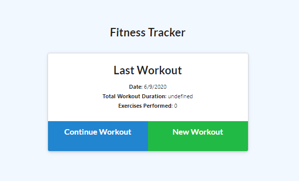

# Fitness Tracker
Homework Week 17 - Fitness Tracker 
Author: Foti Mougos 
[Deployed At Github](https://foteye.github.io/Wk17-Fitness-Tracker/ "Deployed at Github")

### Brief:
For this assignment, you'll create a workout tracker. You have already been provided with the front end code in the `Develop` folder. This assignment will require you to create Mongo database with a Mongoose schema and handle routes with Express.

#### User Story
* As a user, I want to be able to view create and track daily workouts. I want to be able to log multiple exercises in a workout on a given day. I should also be able to track the name, type, weight, sets, reps, and duration of exercise. If the exercise is a cardio exercise, I should be able to track my distance traveled.

The user should be able to:
  * Add exercises to a previous workout plan.
  * Add new exercises to a new workout plan.
  * View multiple the combined weight of multiple exercises on the `stats` page.

### Website Demo

### Lessons Learned:

 * Dont get food poisoning
 * Still dont understand where the mongo data is _stored_? Is it just in my server's ram?
 * The code in the public folder was convoluted and hard to understand. Made troubleshooting incredibly difficult
 * The code in the public folder was also not the way I would have labelled, named, organised (etc) things on the page. This made it harder again, as I didn't expect my routes to work in that way.
 * Didnt get the summary page working with duration properly. Can't work out the provided code and where its going wrong.
